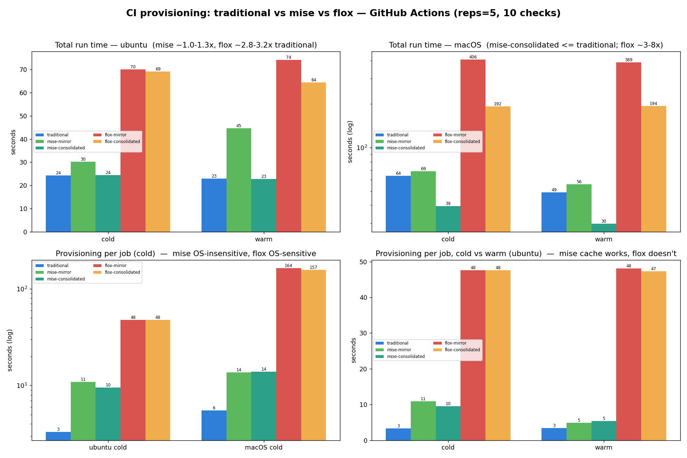
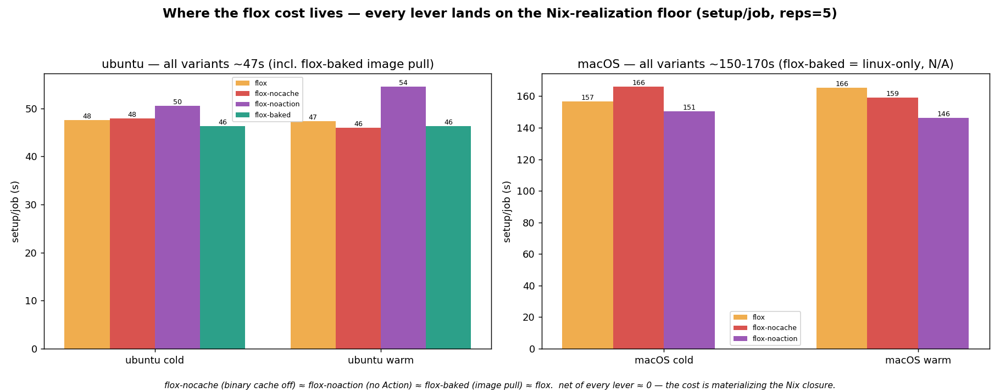

# ADR-12: Flox for developer-environment provisioning

- Status: proposed
- Date: 2026-05-30 (updated 2026-05-31 with CI timing experiment results)
- Deciders: Steve Morin

## Context

The repo provisions its developer toolchain three different ways:

- **Install scripts** — `scripts/install-bun.sh`, `install-gitleaks.sh`,
  `install-lefthook.sh`: curl-pipe-bash installers with hand-pinned versions,
  per-platform detection (`detect_platform()`), SHA256 verification, and manual
  `PATH`/`.zshenv` munging. Each carries a "review pin every 6 months" cadence.
- **Makefile** — `make check` / `make hook-check`: *audit* whether `just`, `uv`,
  `lefthook`, `gitleaks`, `bun`, `editorconfig-checker`, `yamllint`, `codespell`
  are present, plus `install-uv*`/`install-just*`/`set-path` targets that print
  install commands and append to `.zshenv`. The Makefile can detect a missing
  tool but cannot reproducibly *provide* it.
- **Devcontainer** (ADR-11) — re-runs the same install scripts in
  `postCreateCommand` and hand-sets `PATH`/`BUN_INSTALL` in `remoteEnv`.

This is three overlapping sources of truth for "which binaries does a contributor
need, at which versions, on which platform." [Flox](https://flox.dev) is a
Nix-backed environment manager that declares the toolchain once in
`.flox/env/manifest.toml`, locks it cross-platform in `manifest.lock`, and puts
it all on `PATH` via `flox activate`.

A catalog check (`flox search`, Flox 1.12.1) confirmed **every** tool in the
current toolchain is available in the Flox/nixpkgs catalog — including the
brand-new `ty`, `commitlint`, and `cogapp`. So the question is not whether Flox
*can* manage the toolchain, but **which parts it should own** versus leave to the
lockfile-based managers (`uv.lock`, `bun.lock`) already in place.

## Decision drivers

- One declarative, cross-platform, lockfile-reproducible source for the binary
  toolchain (replacing 3 install scripts + the Makefile audit targets).
- Avoid duplicating dependency ownership: `uv.lock` (the app + dev closures) and
  `bun.lock` (commitlint) must remain the single source of truth for the package
  graphs they already pin.
- Keep local dev and the devcontainer (ADR-11) on one definition.
- Weigh against the Makefile's founding rationale — "make it easy ... because
  almost everyone has `make`" — which is the philosophical opposite of requiring
  a new prerequisite (Flox) on every contributor.

## Governing principle

**Flox provides binaries and runtimes; `uv.lock` and `bun.lock` keep owning the
locked dependency closures.** Flox installs the `uv` executable, the Python 3.12
interpreter, and the `bun` runtime — and `uv sync` / `bun install` still resolve
the project's actual package graphs underneath.

## Item-by-item inventory

### Bucket 1 — Flox owns (replaces install scripts + Makefile audit)

System binaries and language runtimes. All verified in catalog.

| Item | Today | Under Flox (`[install]`) |
| --- | --- | --- |
| Python 3.12 | `.python-version` + uv | `python312` |
| `uv` | `install-uv-force` (curl) | `flox/uv` |
| `just` | `install-just-force` (curl) | `just` |
| `bun` | `scripts/install-bun.sh` (pin 1.3.5) | `bun` |
| `lefthook` | `scripts/install-lefthook.sh` (via bun) | `lefthook` |
| `gitleaks` | `scripts/install-gitleaks.sh` (tarball+SHA) | `gitleaks` |
| `gh` | assumed pre-installed | `gh` |
| `make` | assumed pre-installed | `gnumake` |
| `taplo` | `just install-taplo` | `taplo` |
| `node` (if needed) | via bun | `nodejs` |

Direct casualties: all three `scripts/install-*.sh`; the
`install-uv*`/`install-just*`/`set-path` Makefile targets; and the entire reason
`make check` / `make hook-check` exist (Flox guarantees presence rather than
auditing it).

### Bucket 2 — Flox provides the runner, lockfile keeps ownership

Do **not** move these into `[install]` — that would create two sources of truth.

| Item | Stays in | Why |
| --- | --- | --- |
| App deps (click, rich, requests, thefuzz…) | `uv.lock` | Application closure |
| `pytest`, `pytest-cov` | dev group (uv) | Test runner pinned with app |
| `mypy`, `ty` | dev group (uv) | `ty>=0.0.1a16` is a pre-release pin uv tracks exactly |
| `bandit` | dev group (uv) | Pinned with its `pyproject.toml` config |
| `cogapp` | docs/dev group (uv) | Python lib, not a standalone binary |

### Bucket 3 — judgment call (general-purpose, currently `uvx`/`bunx`-invoked)

Catalog-available and runtime-agnostic, so movable — but presently version-pinned
through uv/bun.

| Item | Today | Recommendation |
| --- | --- | --- |
| `ruff` | `uvx ruff` (also dev group) | **Move** — standalone Rust binary, no Python-env coupling |
| `editorconfig-checker` | `bunx editorconfig-checker` | **Move** — drops a bun dependency |
| `yamllint` | `uvx yamllint` | Optional — small win |
| `codespell` | `uvx codespell` | Optional — small win |
| `commitlint` | `bunx commitlint` (bun.lock) | **Keep in bun** — config lives in `commitlint.config.mjs`; moving splits config from binary |

Once moved, the lefthook hooks simplify (`uvx yamllint` → `yamllint`).

### Bucket 4 — Flox cannot manage (out of scope)

| Item | Why not |
| --- | --- |
| ReadTheDocs build | External CI with its own environment |
| `release-please` | Runs in GitHub Actions, not locally |
| Tool *configs* / app *code* | Configuration & source, not provisioning |
| Pinned graphs in `uv.lock` / `bun.lock` | Owned by the uv/bun resolvers |

## Migration delta (if adopted)

1. `flox init` → commit `.flox/env/manifest.toml` + `manifest.lock`.
2. Populate `[install]` with Bucket 1 (+ chosen Bucket 3 items), pinned & locked.
3. `[hook] on-activate` runs the old provisioning: `uv sync --group dev` then
   `lefthook install`.
4. `[vars]`/`[profile]` replace the devcontainer `remoteEnv` and the Makefile
   `.zshenv` `PATH` logic — Flox sets `PATH` on `flox activate`.
5. `[options].systems = ["aarch64-darwin", "x86_64-linux"]` — what the install
   scripts' `detect_platform()` did by hand.
6. Repoint the devcontainer (ADR-11): `flox activate` in `postCreateCommand`, or
   replace it with `flox containerize` (OCI image from the same manifest).
7. CI: swap ad-hoc tool installs for `flox/install-flox-action` +
   `flox activate -- just check`.
8. Retire `scripts/install-{bun,gitleaks,lefthook}.sh`; gut the Makefile
   `check`/`hook-check`/`install-*`/`set-path` targets; replace the "review pin
   every 6 months" cadence with `flox upgrade`.

Sketch:

```toml
[install]
python.pkg-path = "python312"
uv.pkg-path = "uv"
just.pkg-path = "just"
bun.pkg-path = "bun"
lefthook.pkg-path = "lefthook"
gitleaks.pkg-path = "gitleaks"
gh.pkg-path = "gh"
taplo.pkg-path = "taplo"
ruff.pkg-path = "ruff"                                  # Bucket 3 (recommended)
editorconfig-checker.pkg-path = "editorconfig-checker"  # Bucket 3 (recommended)

[hook]
on-activate = '''
  uv sync --group dev
  lefthook install
'''

[options]
systems = ["aarch64-darwin", "x86_64-linux"]
```

## Consequences

**Positive**

- One declarative, cross-platform, lockfile-reproducible toolchain definition.
- Deletes ~3 shell scripts and most of the Makefile; local dev and devcontainer
  share one definition.
- Version drift becomes `flox upgrade` + commit instead of editing pins in shell.

**Negative / trade-offs**

- Adds Flox (and thus Nix) as a contributor prerequisite — contradicting the
  Makefile's "almost everyone has `make`" premise. This is the central tension.
- Two activation models coexist during transition (`flox activate` vs. bare
  shell) until the scripts/Makefile are retired.
- **CI is ~2.8–7.9× slower** when provisioned via Flox (empirical — see below):
  ~90–94% provisioning overhead. This hits migration step #7 (CI) specifically;
  local-dev/devcontainer activation (one `flox activate` per shell) is unaffected.

**Neutral**

- `uv.lock` and `bun.lock` are unchanged — Flox layers *under* them, not over.
- Keep `ty` (pre-release pin) and `commitlint` (config-next-to-binary) in their
  current managers even though both are catalog-available.

## Empirical evidence — CI timing experiment (2026-05-31, mise added 2026-06-01)

Migration step #7 (swap CI tool-installs for a managed toolchain) was tested directly with
a GitHub Actions benchmark: 5 sides × 2 OS × cold/warm × 5 reps — `traditional` vs
`flox-mirror`/`flox-consolidated` (Nix store via `flox activate`) vs
`mise-mirror`/`mise-consolidated` (release-binary/pipx/npm toolchain via `mise`). Full
write-up, raw data, and figures: [`experiment/FINDINGS.md`](../../experiment/FINDINGS.md)
(on branch `experiment/flox-ci-timing`).



**Result: Flox CI is ~2.8–7.9× slower; mise is the middle ground (~1.0–1.3× on ubuntu, and on
macOS `mise-consolidated` matches/beats traditional).** (Cleaned Stage-3 data; macOS-cold
traditional baseline is noisy — see FINDINGS caveats.)

| total run time (avg) | ubuntu cold/warm | macOS cold/warm |
| --- | ---: | ---: |
| traditional | 24 / 23s | 64 / 49s |
| mise-consolidated | 25 / 23s | **39 / 30s** |
| mise-mirror | 30 / 45s | 69 / 56s |
| flox-consolidated | 69 / 64s | 192 / 194s |
| flox-mirror | 70 / 74s | 406 / 389s |

- **The checks run at the same speed on all three** — the cost is *provisioning*. Flox is
  **~90–94% provisioning** (install + activate + Nix-store cache-save); ~1358s/run for
  flox-mirror on macOS. mise is ~12s/job; traditional ~3s/job.
- **Flox is OS-sensitive** (Nix build: ~47s ubuntu → ~136s macOS) with an **ineffective warm
  cache**. **mise is OS-insensitive** (~12s ubuntu ≈ ~14s macOS — release binaries) with an
  **effective warm cache** (~4–7s warm), so warm mise approaches/undercuts traditional.
- **Consolidation** is decisive for flox (expensive install paid 10× vs 2×) and matters for
  mise on macOS (higher per-job overhead), neutral for mise on ubuntu.
- **Reliability flips to the managed envs** — 0 flox *and* mise failures; traditional's
  runtime binary downloads flaked (`editorconfig` npm download ~45%, excluded).

**Implication.** Buckets 1–3 (local dev + devcontainer) are unaffected — one activation per
shell. For **CI (step #7)**: **Flox imposes a ~2.8–7.9× tax** (Nix build, worst on macOS) —
not recommended as-is; consolidated-only if pursued. **mise delivers the single-manifest
simplicity + reliability *without* flox's tax** (~2× traditional on ubuntu, ≈ traditional on
macOS), so it is the recommended option if a single-source-of-truth toolchain manager is
wanted in CI; plain traditional stays fastest in raw ubuntu terms.

### v2 — isolating *where* the flox cost lives (2026-06-04)

A follow-up re-ran the matrix (reps=5, both OS) with three further flox sides, each changing
one variable vs. `flox`: **`flox-nocache`** (`install-flox-action` with `use-cache: false`),
**`flox-noaction`** (manual pinned `.deb`/`.pkg` install, no Action), and **`flox-baked`**
(the whole env baked into a container image — setup = the image pull; Linux-only).



| setup/job (consolidated) | ubuntu cold/warm | macOS cold/warm |
| --- | ---: | ---: |
| flox (action + bin-cache) | 48 / 47s | 157 / 166s |
| flox-nocache (no bin-cache) | 48 / 46s | 166 / 159s |
| flox-noaction (manual install) | 50 / 55s | 151 / 146s |
| flox-baked (container pull) | 46 / 46s | — (linux-only) |

**Result: none of the three levers moves the cost.** The flox CLI-binary cache saves ~0
(`flox`→`flox-nocache`); the GitHub Action wrapper adds ~0 (`flox-nocache`→`flox-noaction`);
and **pre-baking the entire realized env into a container image doesn't help** — the 1.5 GB
image **pull (~46s) ≈ the install it replaced** (`net = setup_saved − pull_added ≈ 0`). The
flox cost is **irreducibly the Nix-store realization** (~47s ubuntu / ~160s macOS): every
approach must materialize the closure, by install+realize or by image-pull. This *strengthens*
the decision above — the ~2.8–7.9× tax is not an artifact of the Action or a missing cache, and
is not removable by containerization **on ubuntu**. (`flox-baked` is Linux-only, so the
containerization result is **ubuntu-only** — untested on macOS, where the tax is largest.
`flox-noaction`'s manual macOS `.pkg` install also flaked intermittently, needing a retry —
a small robustness edge for the Action.)

> Data provenance: an earlier cut had cross-OS run-ID contamination (concurrent ubuntu+macOS
> dispatch); the driver now verifies runner OS, the 4 bad runs were purged, and affected cells
> re-collected. The numbers above are the cleaned data (the fix lowered the ubuntu multiplier
> from a stale 3.8× to ~2.9×). Per-cell n varies (some low-n macOS-mirror cells) — see FINDINGS.

## Status note

`proposed` — this ADR records the analysis and decision space. The CI experiment settles the
**CI** sub-question: **Flox CI is markedly slower** (step #7 not recommended as-is); **mise**
is a viable single-source-of-truth alternative without the speed tax; plain traditional is
fastest on ubuntu. The local-dev / devcontainer migration (Buckets 1–3) remains an open
`proposed` decision. Adoption of any path is a separate step behind its own ITM.
```
