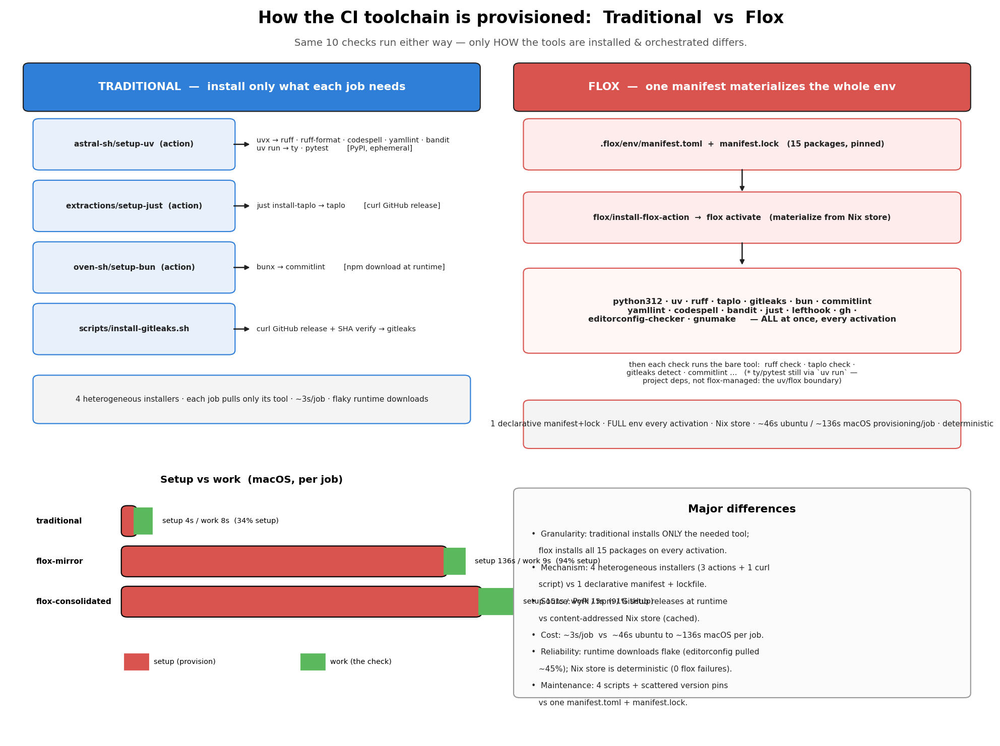

# Flox vs. Traditional CI — Timing Experiment Findings

**Question:** Does provisioning this repo's CI toolchain with [Flox](https://flox.dev)
(Nix-based) instead of the traditional per-tool installs (`setup-uv`, `setup-just`,
`bunx`, release-download scripts) make GitHub Actions faster or slower? Informs ADR-12.

**TL;DR:** Flox is **3.8× slower on ubuntu and up to ~8.7× slower on macOS** — and it's
**~90–94% provisioning**: the actual checks run at the *same speed* on both sides
(see root-cause below); essentially all of flox's cost is installing/activating the env
and saving its Nix store to cache. Traditional wins decisively on speed; Flox wins
decisively on reliability (0 failures vs traditional's flaky binary downloads).
Consolidating flox activations is the single biggest mitigation.

## Method

- **Matrix:** 3 sides × 2 OS × 2 cache × 5 reps on GitHub-hosted runners.
  - Sides: `traditional` (per-tool install), `flox-mirror` (same 10 checks, each under its
    own `flox activate`), `flox-consolidated` (checks share one activation; 2 jobs).
  - OS: `ubuntu-latest`, `macos-latest`. Cache: cold / warm (Nix store + uv/bun caches).
- **10 checks measured:** ruff-check, ruff-format, ty, pytest, taplo, codespell, yamllint,
  bandit, gitleaks, commitlint. (`editorconfig` dropped — see caveats.)
- A driver dispatches runs serially, **excludes failed reps** (never records bad samples);
  `analyze.py` pulls run/job/step timings from the GitHub API.
- Samples: n=5 per cell except `traditional·macOS·warm` (n=3, one transient failure).

## Results — total run time (avg seconds, Δ% vs traditional)

| side | ubuntu cold | ubuntu warm | macOS cold | macOS warm |
| --- | ---: | ---: | ---: | ---: |
| traditional | 17.2 | 17.2 | 36.4 | 38.7 |
| flox-mirror | 64.8 (+277%) | 64.6 (+276%) | 318.4 (+775%) | 303.6 (+685%) |
| flox-consolidated | 64.8 (+277%) | 62.8 (+265%) | 181.6 (+399%) | 161.6 (+318%) |

## Results — provisioning (setup) vs work

`setup` = all provisioning: the `provision` step (flox install/activate, or
setup-uv/just/bun) **plus** the `Post provision` cache-save step.
`provisioning/run` = setup summed across all jobs in a run (cumulative billable cost).

| side | setup/job (ubuntu) | setup/job (macOS) | setup % of job | provisioning/run (ubuntu) | provisioning/run (macOS) |
| --- | ---: | ---: | ---: | ---: | ---: |
| traditional | ~3s | ~4–5s | 34–41% | ~30s | ~41–50s |
| flox-mirror | ~47s | ~130s | **90–94%** | ~465–476s | **~1288–1358s** |
| flox-consolidated | ~49s | ~129–151s | 85–91% | ~97–99s | ~258–301s |

## Root cause — why flox "work" looked longer (it isn't)

The checks themselves run at the **same speed** regardless of provisioning. Per-step,
same check, macOS cold:

| step | flox-mirror | traditional |
| --- | ---: | ---: |
| `provision` (install + activate) | 97–136s | 3–4s |
| **`run` (the actual check)** | **identical** — ruff 1s=1s · codespell 0s=0s · yamllint 1s=1s · ty 2s≈1s · pytest 10s≈6s | — |
| `Post provision` (cache **save**) | 19–39s | 0s |

The "longer flox work" in an earlier cut was a **measurement artifact**: the per-job
split only subtracted the *pre*-step `provision (flox)` from the total, so the *post*-step
**`Post provision (flox)` — the `actions/cache` step that saves the ~Nix store (19–39s on
macOS) — leaked into "work."** Counting that cache-save as provisioning (it is) makes work
fall to ~5s ubuntu / ~8–9s per job — **equal to traditional** — and pushes flox's setup to
~90–94%. Conclusion: **flox doesn't run the checks slower; ~all of its CI cost is
provisioning** (install + activate + cache-save).

## Results — reliability

| side | failures across ~110 runs |
| --- | --- |
| flox-mirror / flox-consolidated | **0** (both OS) |
| traditional | flaky `editorconfig` (removed); 1 transient on macOS |

## What gets provisioned — traditional vs flox

| check | traditional installer (source) | flox |
| --- | --- | --- |
| ruff · ruff-format · codespell · yamllint · bandit | `astral-sh/setup-uv` → `uvx <tool>` (PyPI) | bare tool from Nix store |
| ty · pytest | `astral-sh/setup-uv` → `uv run` (project venv) | `uv run` (same — project deps, not flox-managed) |
| taplo | `extractions/setup-just` → `just install-taplo` (curl GitHub release) | bare `taplo` from Nix store |
| commitlint | `oven-sh/setup-bun` → `bunx commitlint` (npm) | bare `commitlint` from Nix store |
| gitleaks | `scripts/install-gitleaks.sh` (curl GitHub release + SHA) | bare `gitleaks` from Nix store |

- **Traditional:** 4 heterogeneous installers (3 marketplace/official actions + 1 curl
  script); each job installs **only the tool it needs**, from PyPI / npm / GitHub releases
  at runtime (~3s/job, but flaky under load).
- **Flox:** one `.flox/env/manifest.toml` (15 pinned packages) → `flox/install-flox-action`
  + `flox activate` materializes the **entire** toolchain from the content-addressed Nix
  store on every activation (python312, uv, ruff, taplo, gitleaks, bun, commitlint, yamllint,
  codespell, bandit, just, lefthook, gh, editorconfig-checker, gnumake), then runs each check
  as a bare command. ~46s ubuntu / ~136s macOS provisioning per job (install + activate +
  cache-save), deterministic. (`ty` & `pytest` come from `uv run` either way — project deps,
  not flox-managed: the uv/flox boundary.)
- **Major differences:** granularity (only-needed-tool vs whole-env-every-time) · mechanism
  (4 installers vs 1 manifest) · source (runtime PyPI/npm/GitHub vs Nix store) · cost
  (~3s vs ~46–136s/job) · reliability (flaky downloads vs deterministic) · maintenance
  (4 scripts + scattered version pins vs one `manifest.toml` + `manifest.lock`).

## Key findings

1. **The flox CI tax is provisioning, not the checks.** ~90–94% of each flox job is
   provisioning (install + activate + cache-save); the actual check `run` step is **equal to
   traditional** (e.g. ruff 1s, codespell 0s, ty ~2s — same both sides). See Root cause.
2. **macOS is where Flox hurts most.** Per-job flox provisioning is ~130s on macOS vs ~47s
   on ubuntu (Nix-on-macOS cold build + larger cache save), pushing flox-mirror to ~8.7×.
3. **Consolidation is the decisive lever — where provisioning is costly.** mirror and
   consolidated have ~equal per-job setup, but mirror pays it 10× (1100s/run on macOS) vs
   consolidated ~2× (225s/run). Identical work, ~4.5× less provisioning. On ubuntu the two
   are equal because the per-job flox cost is small enough not to dominate.
4. **Warm cache barely helps** (macOS setup 110→105s; ubuntu 38→39s). The
   `flox/install-flox-action` + activation overhead dominates over the cacheable Nix store —
   the thing to fix if flox-in-CI is ever to be viable.
5. **Reliability flips for Flox.** Zero flox failures; traditional's runtime binary downloads
   flake under load (the deterministic Nix store does not).

## Implication for ADR-12

The maintenance win is real (~400 LOC deleted, one declarative manifest) and Flox is more
reliable — but it carries a quantified **CI-speed tax of 3.8–8.7×**, dominated by
provisioning. It's a **simplicity + reliability vs. CI-speed** tradeoff, not a free win.
If adopted: **the consolidated-activation topology is mandatory** (especially on macOS), and
the install-action/activation overhead (not caching) is the lever to optimize.

## Caveats

- `editorconfig` was excluded: its only traditional path (npm `editorconfig-checker`)
  downloads a binary from GitHub at runtime and flaked ~45% (rate-limit + corrupt archive)
  under the driver's rapid runs — isolated entirely to that one item (0 failures elsewhere or
  on the flox side). Itself a reliability data point.
- "Total run time" = GitHub's reported run wall-clock (parallel jobs for mirror/traditional;
  2 jobs for consolidated). Setup is per-job; `provisioning/run` sums it (billable view).
- Preliminary; single repo; GitHub-hosted runners; n=5 (n=3 for one cell).
