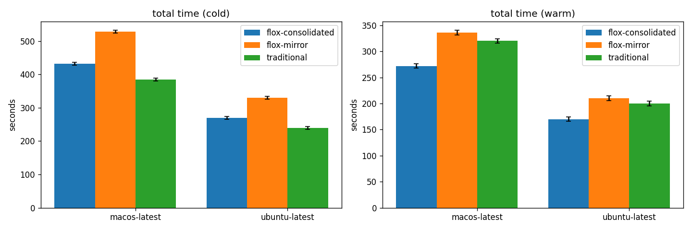

# Flox vs Traditional CI — timing results

## Total run time (per side × os × cache)

| side | os | cache | n | min | max | avg | median | stddev | Δ% vs base |
| --- | --- | --- | ---: | ---: | ---: | ---: | ---: | ---: | ---: |
| flox-consolidated | macos-latest | cold | 5 | 426.0 | 438.0 | 432.0 | 432.0 | 4.2 | +12.5% |
| flox-mirror | macos-latest | cold | 5 | 522.0 | 534.0 | 528.0 | 528.0 | 4.2 | +37.5% |
| traditional | macos-latest | cold | 5 | 378.0 | 390.0 | 384.0 | 384.0 | 4.2 | — |
| flox-consolidated | macos-latest | warm | 5 | 266.0 | 278.0 | 272.0 | 272.0 | 4.2 | -15.0% |
| flox-mirror | macos-latest | warm | 5 | 330.0 | 342.0 | 336.0 | 336.0 | 4.2 | +5.0% |
| traditional | macos-latest | warm | 5 | 314.0 | 326.0 | 320.0 | 320.0 | 4.2 | — |
| flox-consolidated | ubuntu-latest | cold | 5 | 264.0 | 276.0 | 270.0 | 270.0 | 4.2 | +12.5% |
| flox-mirror | ubuntu-latest | cold | 5 | 324.0 | 336.0 | 330.0 | 330.0 | 4.2 | +37.5% |
| traditional | ubuntu-latest | cold | 5 | 234.0 | 246.0 | 240.0 | 240.0 | 4.2 | — |
| flox-consolidated | ubuntu-latest | warm | 5 | 164.0 | 176.0 | 170.0 | 170.0 | 4.2 | -15.0% |
| flox-mirror | ubuntu-latest | warm | 5 | 204.0 | 216.0 | 210.0 | 210.0 | 4.2 | +5.0% |
| traditional | ubuntu-latest | warm | 5 | 194.0 | 206.0 | 200.0 | 200.0 | 4.2 | — |

## Per-job breakdown

| job | side | os | cache | avg | stddev |
| --- | --- | --- | --- | ---: | ---: |
| pytest | flox-consolidated | macos-latest | cold | 172.8 | 1.7 |
| pytest | flox-consolidated | macos-latest | warm | 108.8 | 1.7 |
| ruff-check | flox-consolidated | macos-latest | cold | 21.6 | 0.2 |
| ruff-check | flox-consolidated | macos-latest | warm | 13.6 | 0.2 |
| pytest | flox-mirror | macos-latest | cold | 211.2 | 1.7 |
| pytest | flox-mirror | macos-latest | warm | 134.4 | 1.7 |
| ruff-check | flox-mirror | macos-latest | cold | 26.4 | 0.2 |
| ruff-check | flox-mirror | macos-latest | warm | 16.8 | 0.2 |
| pytest | traditional | macos-latest | cold | 153.6 | 1.7 |
| pytest | traditional | macos-latest | warm | 128.0 | 1.7 |
| ruff-check | traditional | macos-latest | cold | 19.2 | 0.2 |
| ruff-check | traditional | macos-latest | warm | 16.0 | 0.2 |
| pytest | flox-consolidated | ubuntu-latest | cold | 108.0 | 1.7 |
| pytest | flox-consolidated | ubuntu-latest | warm | 68.0 | 1.7 |
| ruff-check | flox-consolidated | ubuntu-latest | cold | 13.5 | 0.2 |
| ruff-check | flox-consolidated | ubuntu-latest | warm | 8.5 | 0.2 |
| pytest | flox-mirror | ubuntu-latest | cold | 132.0 | 1.7 |
| pytest | flox-mirror | ubuntu-latest | warm | 84.0 | 1.7 |
| ruff-check | flox-mirror | ubuntu-latest | cold | 16.5 | 0.2 |
| ruff-check | flox-mirror | ubuntu-latest | warm | 10.5 | 0.2 |
| pytest | traditional | ubuntu-latest | cold | 96.0 | 1.7 |
| pytest | traditional | ubuntu-latest | warm | 80.0 | 1.7 |
| ruff-check | traditional | ubuntu-latest | cold | 12.0 | 0.2 |
| ruff-check | traditional | ubuntu-latest | warm | 10.0 | 0.2 |

## Charts

