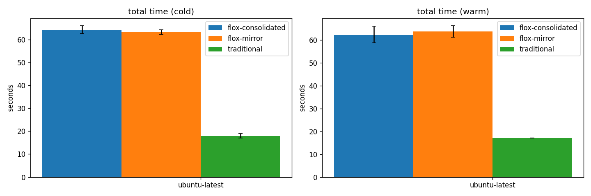

# Flox vs Traditional CI — timing results

## Total run time (per side × os × cache)

| side | os | cache | n | min | max | avg | median | stddev | Δ% vs base |
| --- | --- | --- | ---: | ---: | ---: | ---: | ---: | ---: | ---: |
| flox-consolidated | ubuntu-latest | cold | 3 | 62.0 | 66.0 | 64.3 | 65.0 | 1.7 | +257.4% |
| flox-mirror | ubuntu-latest | cold | 3 | 62.0 | 64.0 | 63.3 | 64.0 | 0.9 | +251.9% |
| traditional | ubuntu-latest | cold | 2 | 17.0 | 19.0 | 18.0 | 18.0 | 1.0 | — |
| flox-consolidated | ubuntu-latest | warm | 3 | 58.0 | 67.0 | 62.3 | 62.0 | 3.7 | +266.7% |
| flox-mirror | ubuntu-latest | warm | 3 | 61.0 | 67.0 | 63.7 | 63.0 | 2.5 | +274.5% |
| traditional | ubuntu-latest | warm | 1 | 17.0 | 17.0 | 17.0 | 17.0 | 0.0 | — |

## Per-job breakdown

| job | side | os | cache | avg | stddev |
| --- | --- | --- | --- | ---: | ---: |
| hygiene | flox-consolidated | ubuntu-latest | cold | 57.0 | 0.8 |
| hygiene | flox-consolidated | ubuntu-latest | warm | 53.3 | 3.3 |
| pytest | flox-consolidated | ubuntu-latest | cold | 59.3 | 1.2 |
| pytest | flox-consolidated | ubuntu-latest | warm | 57.0 | 4.1 |
| checks / bandit | flox-mirror | ubuntu-latest | cold | 51.3 | 3.4 |
| checks / bandit | flox-mirror | ubuntu-latest | warm | 53.0 | 4.9 |
| checks / codespell | flox-mirror | ubuntu-latest | cold | 50.0 | 3.6 |
| checks / codespell | flox-mirror | ubuntu-latest | warm | 52.7 | 3.3 |
| checks / commitlint | flox-mirror | ubuntu-latest | cold | 52.7 | 6.8 |
| checks / commitlint | flox-mirror | ubuntu-latest | warm | 52.3 | 2.5 |
| checks / editorconfig | flox-mirror | ubuntu-latest | cold | 52.7 | 4.9 |
| checks / editorconfig | flox-mirror | ubuntu-latest | warm | 55.3 | 4.1 |
| checks / gitleaks | flox-mirror | ubuntu-latest | cold | 50.3 | 3.3 |
| checks / gitleaks | flox-mirror | ubuntu-latest | warm | 52.3 | 1.7 |
| checks / pytest | flox-mirror | ubuntu-latest | cold | 52.3 | 2.9 |
| checks / pytest | flox-mirror | ubuntu-latest | warm | 57.3 | 3.4 |
| checks / ruff-check | flox-mirror | ubuntu-latest | cold | 55.0 | 3.6 |
| checks / ruff-check | flox-mirror | ubuntu-latest | warm | 54.0 | 1.6 |
| checks / ruff-format | flox-mirror | ubuntu-latest | cold | 52.3 | 3.3 |
| checks / ruff-format | flox-mirror | ubuntu-latest | warm | 49.3 | 5.4 |
| checks / taplo | flox-mirror | ubuntu-latest | cold | 50.3 | 4.0 |
| checks / taplo | flox-mirror | ubuntu-latest | warm | 54.0 | 4.2 |
| checks / ty | flox-mirror | ubuntu-latest | cold | 50.3 | 2.1 |
| checks / ty | flox-mirror | ubuntu-latest | warm | 52.7 | 5.4 |
| checks / yamllint | flox-mirror | ubuntu-latest | cold | 51.0 | 2.9 |
| checks / yamllint | flox-mirror | ubuntu-latest | warm | 50.0 | 1.6 |
| checks / bandit | traditional | ubuntu-latest | cold | 9.0 | 0.0 |
| checks / bandit | traditional | ubuntu-latest | warm | 10.0 | 0.0 |
| checks / codespell | traditional | ubuntu-latest | cold | 7.0 | 2.0 |
| checks / codespell | traditional | ubuntu-latest | warm | 6.0 | 0.0 |
| checks / commitlint | traditional | ubuntu-latest | cold | 7.0 | 0.0 |
| checks / commitlint | traditional | ubuntu-latest | warm | 8.0 | 0.0 |
| checks / editorconfig | traditional | ubuntu-latest | cold | 8.5 | 1.5 |
| checks / editorconfig | traditional | ubuntu-latest | warm | 7.0 | 0.0 |
| checks / gitleaks | traditional | ubuntu-latest | cold | 9.0 | 0.0 |
| checks / gitleaks | traditional | ubuntu-latest | warm | 5.0 | 0.0 |
| checks / pytest | traditional | ubuntu-latest | cold | 12.0 | 3.0 |
| checks / pytest | traditional | ubuntu-latest | warm | 12.0 | 0.0 |
| checks / ruff-check | traditional | ubuntu-latest | cold | 7.5 | 1.5 |
| checks / ruff-check | traditional | ubuntu-latest | warm | 10.0 | 0.0 |
| checks / ruff-format | traditional | ubuntu-latest | cold | 5.5 | 0.5 |
| checks / ruff-format | traditional | ubuntu-latest | warm | 10.0 | 0.0 |
| checks / taplo | traditional | ubuntu-latest | cold | 7.0 | 1.0 |
| checks / taplo | traditional | ubuntu-latest | warm | 7.0 | 0.0 |
| checks / ty | traditional | ubuntu-latest | cold | 8.0 | 1.0 |
| checks / ty | traditional | ubuntu-latest | warm | 11.0 | 0.0 |
| checks / yamllint | traditional | ubuntu-latest | cold | 8.5 | 1.5 |
| checks / yamllint | traditional | ubuntu-latest | warm | 6.0 | 0.0 |

## Charts

