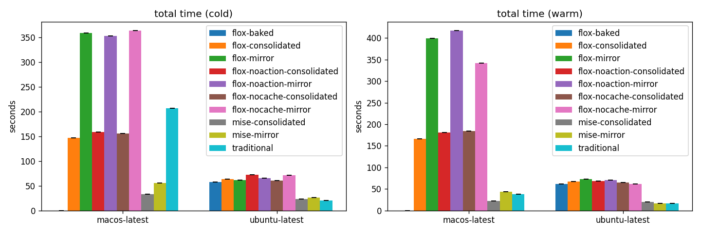

# Flox vs Traditional CI — timing results

Appendix: [last-run workflow wall-clock totals](LAST_RUN_TOTALS.md) records the final successful run per cell using GitHub's literal `run_duration_ms`, including the `flox-baked` container runs.

## Total run time (per side × os × cache)

| side | os | cache | n | min | max | avg | median | stddev | Δ% vs base |
| --- | --- | --- | ---: | ---: | ---: | ---: | ---: | ---: | ---: |
| flox-consolidated | macos-latest | cold | 1 | 147.0 | 147.0 | 147.0 | 147.0 | 0.0 | -28.6% |
| flox-mirror | macos-latest | cold | 1 | 358.0 | 358.0 | 358.0 | 358.0 | 0.0 | +73.8% |
| flox-noaction-consolidated | macos-latest | cold | 1 | 158.0 | 158.0 | 158.0 | 158.0 | 0.0 | -23.3% |
| flox-noaction-mirror | macos-latest | cold | 1 | 353.0 | 353.0 | 353.0 | 353.0 | 0.0 | +71.4% |
| flox-nocache-consolidated | macos-latest | cold | 1 | 155.0 | 155.0 | 155.0 | 155.0 | 0.0 | -24.8% |
| flox-nocache-mirror | macos-latest | cold | 1 | 363.0 | 363.0 | 363.0 | 363.0 | 0.0 | +76.2% |
| mise-consolidated | macos-latest | cold | 1 | 33.0 | 33.0 | 33.0 | 33.0 | 0.0 | -84.0% |
| mise-mirror | macos-latest | cold | 1 | 55.0 | 55.0 | 55.0 | 55.0 | 0.0 | -73.3% |
| traditional | macos-latest | cold | 1 | 206.0 | 206.0 | 206.0 | 206.0 | 0.0 | — |
| flox-consolidated | macos-latest | warm | 1 | 166.0 | 166.0 | 166.0 | 166.0 | 0.0 | +336.8% |
| flox-mirror | macos-latest | warm | 1 | 399.0 | 399.0 | 399.0 | 399.0 | 0.0 | +950.0% |
| flox-noaction-consolidated | macos-latest | warm | 1 | 181.0 | 181.0 | 181.0 | 181.0 | 0.0 | +376.3% |
| flox-noaction-mirror | macos-latest | warm | 1 | 417.0 | 417.0 | 417.0 | 417.0 | 0.0 | +997.4% |
| flox-nocache-consolidated | macos-latest | warm | 1 | 184.0 | 184.0 | 184.0 | 184.0 | 0.0 | +384.2% |
| flox-nocache-mirror | macos-latest | warm | 1 | 342.0 | 342.0 | 342.0 | 342.0 | 0.0 | +800.0% |
| mise-consolidated | macos-latest | warm | 1 | 22.0 | 22.0 | 22.0 | 22.0 | 0.0 | -42.1% |
| mise-mirror | macos-latest | warm | 1 | 43.0 | 43.0 | 43.0 | 43.0 | 0.0 | +13.2% |
| traditional | macos-latest | warm | 1 | 38.0 | 38.0 | 38.0 | 38.0 | 0.0 | — |
| flox-baked | ubuntu-latest | cold | 1 | 57.0 | 57.0 | 57.0 | 57.0 | 0.0 | +185.0% |
| flox-consolidated | ubuntu-latest | cold | 1 | 63.0 | 63.0 | 63.0 | 63.0 | 0.0 | +215.0% |
| flox-mirror | ubuntu-latest | cold | 1 | 61.0 | 61.0 | 61.0 | 61.0 | 0.0 | +205.0% |
| flox-noaction-consolidated | ubuntu-latest | cold | 1 | 72.0 | 72.0 | 72.0 | 72.0 | 0.0 | +260.0% |
| flox-noaction-mirror | ubuntu-latest | cold | 1 | 65.0 | 65.0 | 65.0 | 65.0 | 0.0 | +225.0% |
| flox-nocache-consolidated | ubuntu-latest | cold | 1 | 60.0 | 60.0 | 60.0 | 60.0 | 0.0 | +200.0% |
| flox-nocache-mirror | ubuntu-latest | cold | 1 | 71.0 | 71.0 | 71.0 | 71.0 | 0.0 | +255.0% |
| mise-consolidated | ubuntu-latest | cold | 1 | 23.0 | 23.0 | 23.0 | 23.0 | 0.0 | +15.0% |
| mise-mirror | ubuntu-latest | cold | 1 | 26.0 | 26.0 | 26.0 | 26.0 | 0.0 | +30.0% |
| traditional | ubuntu-latest | cold | 1 | 20.0 | 20.0 | 20.0 | 20.0 | 0.0 | — |
| flox-baked | ubuntu-latest | warm | 1 | 61.0 | 61.0 | 61.0 | 61.0 | 0.0 | +281.2% |
| flox-consolidated | ubuntu-latest | warm | 1 | 67.0 | 67.0 | 67.0 | 67.0 | 0.0 | +318.8% |
| flox-mirror | ubuntu-latest | warm | 1 | 73.0 | 73.0 | 73.0 | 73.0 | 0.0 | +356.2% |
| flox-noaction-consolidated | ubuntu-latest | warm | 1 | 68.0 | 68.0 | 68.0 | 68.0 | 0.0 | +325.0% |
| flox-noaction-mirror | ubuntu-latest | warm | 1 | 70.0 | 70.0 | 70.0 | 70.0 | 0.0 | +337.5% |
| flox-nocache-consolidated | ubuntu-latest | warm | 1 | 65.0 | 65.0 | 65.0 | 65.0 | 0.0 | +306.2% |
| flox-nocache-mirror | ubuntu-latest | warm | 1 | 61.0 | 61.0 | 61.0 | 61.0 | 0.0 | +281.2% |
| mise-consolidated | ubuntu-latest | warm | 1 | 20.0 | 20.0 | 20.0 | 20.0 | 0.0 | +25.0% |
| mise-mirror | ubuntu-latest | warm | 1 | 16.0 | 16.0 | 16.0 | 16.0 | 0.0 | +0.0% |
| traditional | ubuntu-latest | warm | 1 | 16.0 | 16.0 | 16.0 | 16.0 | 0.0 | — |

## Provisioning (setup) vs work — per job

setup = the `provision` step (flox install/activate, or setup-uv/just/bun); work = the rest of the job. `total provisioning/run` = setup summed across all jobs in a run (the cumulative billable provisioning cost).

| side | os | cache | jobs | avg setup/job | avg work/job | setup % | total provisioning/run |
| --- | --- | --- | ---: | ---: | ---: | ---: | ---: |
| flox-consolidated | macos-latest | cold | 2 | 129.0s | 11.5s | 92% | 258s |
| flox-mirror | macos-latest | cold | 10 | 146.8s | 9.6s | 94% | 1468s |
| flox-noaction-consolidated | macos-latest | cold | 2 | 132.0s | 12.0s | 92% | 264s |
| flox-noaction-mirror | macos-latest | cold | 10 | 140.9s | 9.4s | 94% | 1409s |
| flox-nocache-consolidated | macos-latest | cold | 2 | 133.5s | 13.5s | 91% | 267s |
| flox-nocache-mirror | macos-latest | cold | 10 | 150.2s | 8.9s | 94% | 1502s |
| mise-consolidated | macos-latest | cold | 2 | 12.0s | 11.5s | 51% | 24s |
| mise-mirror | macos-latest | cold | 10 | 14.0s | 7.5s | 65% | 140s |
| traditional | macos-latest | cold | 10 | 4.1s | 8.8s | 32% | 41s |
| flox-consolidated | macos-latest | warm | 2 | 145.5s | 14.0s | 91% | 291s |
| flox-mirror | macos-latest | warm | 10 | 154.9s | 8.8s | 95% | 1549s |
| flox-noaction-consolidated | macos-latest | warm | 2 | 144.0s | 13.5s | 91% | 288s |
| flox-noaction-mirror | macos-latest | warm | 10 | 166.4s | 9.6s | 95% | 1664s |
| flox-nocache-consolidated | macos-latest | warm | 2 | 159.5s | 13.5s | 92% | 319s |
| flox-nocache-mirror | macos-latest | warm | 10 | 146.7s | 8.9s | 94% | 1467s |
| mise-consolidated | macos-latest | warm | 2 | 4.5s | 12.5s | 26% | 9s |
| mise-mirror | macos-latest | warm | 10 | 6.3s | 8.5s | 43% | 63s |
| traditional | macos-latest | warm | 10 | 4.6s | 8.5s | 35% | 46s |
| flox-baked | ubuntu-latest | cold | 2 | 44.5s | 7.5s | 86% | 89s |
| flox-consolidated | ubuntu-latest | cold | 2 | 48.0s | 9.0s | 84% | 96s |
| flox-mirror | ubuntu-latest | cold | 10 | 45.0s | 5.5s | 89% | 450s |
| flox-noaction-consolidated | ubuntu-latest | cold | 2 | 57.0s | 7.5s | 88% | 114s |
| flox-noaction-mirror | ubuntu-latest | cold | 10 | 51.5s | 5.6s | 90% | 515s |
| flox-nocache-consolidated | ubuntu-latest | cold | 2 | 47.5s | 7.5s | 86% | 95s |
| flox-nocache-mirror | ubuntu-latest | cold | 10 | 48.3s | 4.4s | 92% | 483s |
| mise-consolidated | ubuntu-latest | cold | 2 | 9.5s | 8.0s | 54% | 19s |
| mise-mirror | ubuntu-latest | cold | 10 | 11.5s | 5.0s | 70% | 115s |
| traditional | ubuntu-latest | cold | 10 | 2.5s | 5.8s | 30% | 25s |
| flox-baked | ubuntu-latest | warm | 2 | 43.5s | 9.5s | 82% | 87s |
| flox-consolidated | ubuntu-latest | warm | 2 | 47.0s | 10.0s | 82% | 94s |
| flox-mirror | ubuntu-latest | warm | 10 | 49.3s | 5.3s | 90% | 493s |
| flox-noaction-consolidated | ubuntu-latest | warm | 2 | 51.0s | 11.5s | 82% | 102s |
| flox-noaction-mirror | ubuntu-latest | warm | 10 | 52.3s | 5.9s | 90% | 523s |
| flox-nocache-consolidated | ubuntu-latest | warm | 2 | 48.5s | 9.0s | 84% | 97s |
| flox-nocache-mirror | ubuntu-latest | warm | 10 | 45.9s | 5.5s | 89% | 459s |
| mise-consolidated | ubuntu-latest | warm | 2 | 5.0s | 10.0s | 33% | 10s |
| mise-mirror | ubuntu-latest | warm | 10 | 2.9s | 5.0s | 37% | 29s |
| traditional | ubuntu-latest | warm | 10 | 3.1s | 4.6s | 40% | 31s |

## Per-job breakdown (total job seconds)

| job | side | os | cache | avg | stddev |
| --- | --- | --- | --- | ---: | ---: |
| hygiene | flox-consolidated | macos-latest | cold | 139.0 | 0.0 |
| hygiene | flox-consolidated | macos-latest | warm | 158.0 | 0.0 |
| pytest | flox-consolidated | macos-latest | cold | 142.0 | 0.0 |
| pytest | flox-consolidated | macos-latest | warm | 161.0 | 0.0 |
| checks / bandit | flox-mirror | macos-latest | cold | 137.0 | 0.0 |
| checks / bandit | flox-mirror | macos-latest | warm | 178.0 | 0.0 |
| checks / codespell | flox-mirror | macos-latest | cold | 183.0 | 0.0 |
| checks / codespell | flox-mirror | macos-latest | warm | 142.0 | 0.0 |
| checks / commitlint | flox-mirror | macos-latest | cold | 169.0 | 0.0 |
| checks / commitlint | flox-mirror | macos-latest | warm | 182.0 | 0.0 |
| checks / gitleaks | flox-mirror | macos-latest | cold | 138.0 | 0.0 |
| checks / gitleaks | flox-mirror | macos-latest | warm | 138.0 | 0.0 |
| checks / pytest | flox-mirror | macos-latest | cold | 148.0 | 0.0 |
| checks / pytest | flox-mirror | macos-latest | warm | 207.0 | 0.0 |
| checks / ruff-check | flox-mirror | macos-latest | cold | 141.0 | 0.0 |
| checks / ruff-check | flox-mirror | macos-latest | warm | 132.0 | 0.0 |
| checks / ruff-format | flox-mirror | macos-latest | cold | 140.0 | 0.0 |
| checks / ruff-format | flox-mirror | macos-latest | warm | 178.0 | 0.0 |
| checks / taplo | flox-mirror | macos-latest | cold | 147.0 | 0.0 |
| checks / taplo | flox-mirror | macos-latest | warm | 152.0 | 0.0 |
| checks / ty | flox-mirror | macos-latest | cold | 211.0 | 0.0 |
| checks / ty | flox-mirror | macos-latest | warm | 169.0 | 0.0 |
| checks / yamllint | flox-mirror | macos-latest | cold | 150.0 | 0.0 |
| checks / yamllint | flox-mirror | macos-latest | warm | 159.0 | 0.0 |
| hygiene | flox-noaction-consolidated | macos-latest | cold | 152.0 | 0.0 |
| hygiene | flox-noaction-consolidated | macos-latest | warm | 140.0 | 0.0 |
| pytest | flox-noaction-consolidated | macos-latest | cold | 136.0 | 0.0 |
| pytest | flox-noaction-consolidated | macos-latest | warm | 175.0 | 0.0 |
| checks / bandit | flox-noaction-mirror | macos-latest | cold | 131.0 | 0.0 |
| checks / bandit | flox-noaction-mirror | macos-latest | warm | 184.0 | 0.0 |
| checks / codespell | flox-noaction-mirror | macos-latest | cold | 160.0 | 0.0 |
| checks / codespell | flox-noaction-mirror | macos-latest | warm | 216.0 | 0.0 |
| checks / commitlint | flox-noaction-mirror | macos-latest | cold | 185.0 | 0.0 |
| checks / commitlint | flox-noaction-mirror | macos-latest | warm | 134.0 | 0.0 |
| checks / gitleaks | flox-noaction-mirror | macos-latest | cold | 134.0 | 0.0 |
| checks / gitleaks | flox-noaction-mirror | macos-latest | warm | 179.0 | 0.0 |
| checks / pytest | flox-noaction-mirror | macos-latest | cold | 140.0 | 0.0 |
| checks / pytest | flox-noaction-mirror | macos-latest | warm | 135.0 | 0.0 |
| checks / ruff-check | flox-noaction-mirror | macos-latest | cold | 132.0 | 0.0 |
| checks / ruff-check | flox-noaction-mirror | macos-latest | warm | 170.0 | 0.0 |
| checks / ruff-format | flox-noaction-mirror | macos-latest | cold | 155.0 | 0.0 |
| checks / ruff-format | flox-noaction-mirror | macos-latest | warm | 178.0 | 0.0 |
| checks / taplo | flox-noaction-mirror | macos-latest | cold | 138.0 | 0.0 |
| checks / taplo | flox-noaction-mirror | macos-latest | warm | 191.0 | 0.0 |
| checks / ty | flox-noaction-mirror | macos-latest | cold | 174.0 | 0.0 |
| checks / ty | flox-noaction-mirror | macos-latest | warm | 182.0 | 0.0 |
| checks / yamllint | flox-noaction-mirror | macos-latest | cold | 154.0 | 0.0 |
| checks / yamllint | flox-noaction-mirror | macos-latest | warm | 191.0 | 0.0 |
| hygiene | flox-nocache-consolidated | macos-latest | cold | 149.0 | 0.0 |
| hygiene | flox-nocache-consolidated | macos-latest | warm | 169.0 | 0.0 |
| pytest | flox-nocache-consolidated | macos-latest | cold | 145.0 | 0.0 |
| pytest | flox-nocache-consolidated | macos-latest | warm | 177.0 | 0.0 |
| checks / bandit | flox-nocache-mirror | macos-latest | cold | 181.0 | 0.0 |
| checks / bandit | flox-nocache-mirror | macos-latest | warm | 147.0 | 0.0 |
| checks / codespell | flox-nocache-mirror | macos-latest | cold | 185.0 | 0.0 |
| checks / codespell | flox-nocache-mirror | macos-latest | warm | 134.0 | 0.0 |
| checks / commitlint | flox-nocache-mirror | macos-latest | cold | 141.0 | 0.0 |
| checks / commitlint | flox-nocache-mirror | macos-latest | warm | 150.0 | 0.0 |
| checks / gitleaks | flox-nocache-mirror | macos-latest | cold | 180.0 | 0.0 |
| checks / gitleaks | flox-nocache-mirror | macos-latest | warm | 132.0 | 0.0 |
| checks / pytest | flox-nocache-mirror | macos-latest | cold | 139.0 | 0.0 |
| checks / pytest | flox-nocache-mirror | macos-latest | warm | 184.0 | 0.0 |
| checks / ruff-check | flox-nocache-mirror | macos-latest | cold | 172.0 | 0.0 |
| checks / ruff-check | flox-nocache-mirror | macos-latest | warm | 158.0 | 0.0 |
| checks / ruff-format | flox-nocache-mirror | macos-latest | cold | 156.0 | 0.0 |
| checks / ruff-format | flox-nocache-mirror | macos-latest | warm | 150.0 | 0.0 |
| checks / taplo | flox-nocache-mirror | macos-latest | cold | 135.0 | 0.0 |
| checks / taplo | flox-nocache-mirror | macos-latest | warm | 143.0 | 0.0 |
| checks / ty | flox-nocache-mirror | macos-latest | cold | 172.0 | 0.0 |
| checks / ty | flox-nocache-mirror | macos-latest | warm | 176.0 | 0.0 |
| checks / yamllint | flox-nocache-mirror | macos-latest | cold | 130.0 | 0.0 |
| checks / yamllint | flox-nocache-mirror | macos-latest | warm | 182.0 | 0.0 |
| hygiene | mise-consolidated | macos-latest | cold | 20.0 | 0.0 |
| hygiene | mise-consolidated | macos-latest | warm | 17.0 | 0.0 |
| pytest | mise-consolidated | macos-latest | cold | 27.0 | 0.0 |
| pytest | mise-consolidated | macos-latest | warm | 17.0 | 0.0 |
| checks / bandit | mise-mirror | macos-latest | cold | 20.0 | 0.0 |
| checks / bandit | mise-mirror | macos-latest | warm | 15.0 | 0.0 |
| checks / codespell | mise-mirror | macos-latest | cold | 21.0 | 0.0 |
| checks / codespell | mise-mirror | macos-latest | warm | 15.0 | 0.0 |
| checks / commitlint | mise-mirror | macos-latest | cold | 20.0 | 0.0 |
| checks / commitlint | mise-mirror | macos-latest | warm | 18.0 | 0.0 |
| checks / gitleaks | mise-mirror | macos-latest | cold | 23.0 | 0.0 |
| checks / gitleaks | mise-mirror | macos-latest | warm | 15.0 | 0.0 |
| checks / pytest | mise-mirror | macos-latest | cold | 25.0 | 0.0 |
| checks / pytest | mise-mirror | macos-latest | warm | 21.0 | 0.0 |
| checks / ruff-check | mise-mirror | macos-latest | cold | 19.0 | 0.0 |
| checks / ruff-check | mise-mirror | macos-latest | warm | 12.0 | 0.0 |
| checks / ruff-format | mise-mirror | macos-latest | cold | 26.0 | 0.0 |
| checks / ruff-format | mise-mirror | macos-latest | warm | 12.0 | 0.0 |
| checks / taplo | mise-mirror | macos-latest | cold | 22.0 | 0.0 |
| checks / taplo | mise-mirror | macos-latest | warm | 10.0 | 0.0 |
| checks / ty | mise-mirror | macos-latest | cold | 20.0 | 0.0 |
| checks / ty | mise-mirror | macos-latest | warm | 17.0 | 0.0 |
| checks / yamllint | mise-mirror | macos-latest | cold | 19.0 | 0.0 |
| checks / yamllint | mise-mirror | macos-latest | warm | 13.0 | 0.0 |
| checks / bandit | traditional | macos-latest | cold | 11.0 | 0.0 |
| checks / bandit | traditional | macos-latest | warm | 14.0 | 0.0 |
| checks / codespell | traditional | macos-latest | cold | 15.0 | 0.0 |
| checks / codespell | traditional | macos-latest | warm | 15.0 | 0.0 |
| checks / commitlint | traditional | macos-latest | cold | 15.0 | 0.0 |
| checks / commitlint | traditional | macos-latest | warm | 12.0 | 0.0 |
| checks / gitleaks | traditional | macos-latest | cold | 11.0 | 0.0 |
| checks / gitleaks | traditional | macos-latest | warm | 12.0 | 0.0 |
| checks / pytest | traditional | macos-latest | cold | 17.0 | 0.0 |
| checks / pytest | traditional | macos-latest | warm | 17.0 | 0.0 |
| checks / ruff-check | traditional | macos-latest | cold | 12.0 | 0.0 |
| checks / ruff-check | traditional | macos-latest | warm | 13.0 | 0.0 |
| checks / ruff-format | traditional | macos-latest | cold | 11.0 | 0.0 |
| checks / ruff-format | traditional | macos-latest | warm | 11.0 | 0.0 |
| checks / taplo | traditional | macos-latest | cold | 11.0 | 0.0 |
| checks / taplo | traditional | macos-latest | warm | 12.0 | 0.0 |
| checks / ty | traditional | macos-latest | cold | 14.0 | 0.0 |
| checks / ty | traditional | macos-latest | warm | 12.0 | 0.0 |
| checks / yamllint | traditional | macos-latest | cold | 12.0 | 0.0 |
| checks / yamllint | traditional | macos-latest | warm | 13.0 | 0.0 |
| hygiene | flox-baked | ubuntu-latest | cold | 52.0 | 0.0 |
| hygiene | flox-baked | ubuntu-latest | warm | 54.0 | 0.0 |
| pytest | flox-baked | ubuntu-latest | cold | 52.0 | 0.0 |
| pytest | flox-baked | ubuntu-latest | warm | 52.0 | 0.0 |
| hygiene | flox-consolidated | ubuntu-latest | cold | 59.0 | 0.0 |
| hygiene | flox-consolidated | ubuntu-latest | warm | 53.0 | 0.0 |
| pytest | flox-consolidated | ubuntu-latest | cold | 55.0 | 0.0 |
| pytest | flox-consolidated | ubuntu-latest | warm | 61.0 | 0.0 |
| checks / bandit | flox-mirror | ubuntu-latest | cold | 52.0 | 0.0 |
| checks / bandit | flox-mirror | ubuntu-latest | warm | 53.0 | 0.0 |
| checks / codespell | flox-mirror | ubuntu-latest | cold | 53.0 | 0.0 |
| checks / codespell | flox-mirror | ubuntu-latest | warm | 55.0 | 0.0 |
| checks / commitlint | flox-mirror | ubuntu-latest | cold | 48.0 | 0.0 |
| checks / commitlint | flox-mirror | ubuntu-latest | warm | 52.0 | 0.0 |
| checks / gitleaks | flox-mirror | ubuntu-latest | cold | 52.0 | 0.0 |
| checks / gitleaks | flox-mirror | ubuntu-latest | warm | 52.0 | 0.0 |
| checks / pytest | flox-mirror | ubuntu-latest | cold | 50.0 | 0.0 |
| checks / pytest | flox-mirror | ubuntu-latest | warm | 68.0 | 0.0 |
| checks / ruff-check | flox-mirror | ubuntu-latest | cold | 50.0 | 0.0 |
| checks / ruff-check | flox-mirror | ubuntu-latest | warm | 53.0 | 0.0 |
| checks / ruff-format | flox-mirror | ubuntu-latest | cold | 56.0 | 0.0 |
| checks / ruff-format | flox-mirror | ubuntu-latest | warm | 50.0 | 0.0 |
| checks / taplo | flox-mirror | ubuntu-latest | cold | 48.0 | 0.0 |
| checks / taplo | flox-mirror | ubuntu-latest | warm | 55.0 | 0.0 |
| checks / ty | flox-mirror | ubuntu-latest | cold | 49.0 | 0.0 |
| checks / ty | flox-mirror | ubuntu-latest | warm | 53.0 | 0.0 |
| checks / yamllint | flox-mirror | ubuntu-latest | cold | 47.0 | 0.0 |
| checks / yamllint | flox-mirror | ubuntu-latest | warm | 55.0 | 0.0 |
| hygiene | flox-noaction-consolidated | ubuntu-latest | cold | 61.0 | 0.0 |
| hygiene | flox-noaction-consolidated | ubuntu-latest | warm | 63.0 | 0.0 |
| pytest | flox-noaction-consolidated | ubuntu-latest | cold | 68.0 | 0.0 |
| pytest | flox-noaction-consolidated | ubuntu-latest | warm | 62.0 | 0.0 |
| checks / bandit | flox-noaction-mirror | ubuntu-latest | cold | 57.0 | 0.0 |
| checks / bandit | flox-noaction-mirror | ubuntu-latest | warm | 56.0 | 0.0 |
| checks / codespell | flox-noaction-mirror | ubuntu-latest | cold | 56.0 | 0.0 |
| checks / codespell | flox-noaction-mirror | ubuntu-latest | warm | 57.0 | 0.0 |
| checks / commitlint | flox-noaction-mirror | ubuntu-latest | cold | 59.0 | 0.0 |
| checks / commitlint | flox-noaction-mirror | ubuntu-latest | warm | 64.0 | 0.0 |
| checks / gitleaks | flox-noaction-mirror | ubuntu-latest | cold | 58.0 | 0.0 |
| checks / gitleaks | flox-noaction-mirror | ubuntu-latest | warm | 58.0 | 0.0 |
| checks / pytest | flox-noaction-mirror | ubuntu-latest | cold | 56.0 | 0.0 |
| checks / pytest | flox-noaction-mirror | ubuntu-latest | warm | 61.0 | 0.0 |
| checks / ruff-check | flox-noaction-mirror | ubuntu-latest | cold | 58.0 | 0.0 |
| checks / ruff-check | flox-noaction-mirror | ubuntu-latest | warm | 58.0 | 0.0 |
| checks / ruff-format | flox-noaction-mirror | ubuntu-latest | cold | 58.0 | 0.0 |
| checks / ruff-format | flox-noaction-mirror | ubuntu-latest | warm | 59.0 | 0.0 |
| checks / taplo | flox-noaction-mirror | ubuntu-latest | cold | 59.0 | 0.0 |
| checks / taplo | flox-noaction-mirror | ubuntu-latest | warm | 61.0 | 0.0 |
| checks / ty | flox-noaction-mirror | ubuntu-latest | cold | 55.0 | 0.0 |
| checks / ty | flox-noaction-mirror | ubuntu-latest | warm | 50.0 | 0.0 |
| checks / yamllint | flox-noaction-mirror | ubuntu-latest | cold | 55.0 | 0.0 |
| checks / yamllint | flox-noaction-mirror | ubuntu-latest | warm | 58.0 | 0.0 |
| hygiene | flox-nocache-consolidated | ubuntu-latest | cold | 55.0 | 0.0 |
| hygiene | flox-nocache-consolidated | ubuntu-latest | warm | 59.0 | 0.0 |
| pytest | flox-nocache-consolidated | ubuntu-latest | cold | 55.0 | 0.0 |
| pytest | flox-nocache-consolidated | ubuntu-latest | warm | 56.0 | 0.0 |
| checks / bandit | flox-nocache-mirror | ubuntu-latest | cold | 51.0 | 0.0 |
| checks / bandit | flox-nocache-mirror | ubuntu-latest | warm | 53.0 | 0.0 |
| checks / codespell | flox-nocache-mirror | ubuntu-latest | cold | 51.0 | 0.0 |
| checks / codespell | flox-nocache-mirror | ubuntu-latest | warm | 52.0 | 0.0 |
| checks / commitlint | flox-nocache-mirror | ubuntu-latest | cold | 51.0 | 0.0 |
| checks / commitlint | flox-nocache-mirror | ubuntu-latest | warm | 49.0 | 0.0 |
| checks / gitleaks | flox-nocache-mirror | ubuntu-latest | cold | 53.0 | 0.0 |
| checks / gitleaks | flox-nocache-mirror | ubuntu-latest | warm | 53.0 | 0.0 |
| checks / pytest | flox-nocache-mirror | ubuntu-latest | cold | 60.0 | 0.0 |
| checks / pytest | flox-nocache-mirror | ubuntu-latest | warm | 52.0 | 0.0 |
| checks / ruff-check | flox-nocache-mirror | ubuntu-latest | cold | 51.0 | 0.0 |
| checks / ruff-check | flox-nocache-mirror | ubuntu-latest | warm | 50.0 | 0.0 |
| checks / ruff-format | flox-nocache-mirror | ubuntu-latest | cold | 54.0 | 0.0 |
| checks / ruff-format | flox-nocache-mirror | ubuntu-latest | warm | 46.0 | 0.0 |
| checks / taplo | flox-nocache-mirror | ubuntu-latest | cold | 51.0 | 0.0 |
| checks / taplo | flox-nocache-mirror | ubuntu-latest | warm | 51.0 | 0.0 |
| checks / ty | flox-nocache-mirror | ubuntu-latest | cold | 52.0 | 0.0 |
| checks / ty | flox-nocache-mirror | ubuntu-latest | warm | 55.0 | 0.0 |
| checks / yamllint | flox-nocache-mirror | ubuntu-latest | cold | 53.0 | 0.0 |
| checks / yamllint | flox-nocache-mirror | ubuntu-latest | warm | 53.0 | 0.0 |
| hygiene | mise-consolidated | ubuntu-latest | cold | 17.0 | 0.0 |
| hygiene | mise-consolidated | ubuntu-latest | warm | 14.0 | 0.0 |
| pytest | mise-consolidated | ubuntu-latest | cold | 18.0 | 0.0 |
| pytest | mise-consolidated | ubuntu-latest | warm | 16.0 | 0.0 |
| checks / bandit | mise-mirror | ubuntu-latest | cold | 14.0 | 0.0 |
| checks / bandit | mise-mirror | ubuntu-latest | warm | 6.0 | 0.0 |
| checks / codespell | mise-mirror | ubuntu-latest | cold | 14.0 | 0.0 |
| checks / codespell | mise-mirror | ubuntu-latest | warm | 7.0 | 0.0 |
| checks / commitlint | mise-mirror | ubuntu-latest | cold | 20.0 | 0.0 |
| checks / commitlint | mise-mirror | ubuntu-latest | warm | 10.0 | 0.0 |
| checks / gitleaks | mise-mirror | ubuntu-latest | cold | 18.0 | 0.0 |
| checks / gitleaks | mise-mirror | ubuntu-latest | warm | 7.0 | 0.0 |
| checks / pytest | mise-mirror | ubuntu-latest | cold | 17.0 | 0.0 |
| checks / pytest | mise-mirror | ubuntu-latest | warm | 11.0 | 0.0 |
| checks / ruff-check | mise-mirror | ubuntu-latest | cold | 19.0 | 0.0 |
| checks / ruff-check | mise-mirror | ubuntu-latest | warm | 7.0 | 0.0 |
| checks / ruff-format | mise-mirror | ubuntu-latest | cold | 21.0 | 0.0 |
| checks / ruff-format | mise-mirror | ubuntu-latest | warm | 6.0 | 0.0 |
| checks / taplo | mise-mirror | ubuntu-latest | cold | 14.0 | 0.0 |
| checks / taplo | mise-mirror | ubuntu-latest | warm | 10.0 | 0.0 |
| checks / ty | mise-mirror | ubuntu-latest | cold | 13.0 | 0.0 |
| checks / ty | mise-mirror | ubuntu-latest | warm | 8.0 | 0.0 |
| checks / yamllint | mise-mirror | ubuntu-latest | cold | 15.0 | 0.0 |
| checks / yamllint | mise-mirror | ubuntu-latest | warm | 7.0 | 0.0 |
| checks / bandit | traditional | ubuntu-latest | cold | 6.0 | 0.0 |
| checks / bandit | traditional | ubuntu-latest | warm | 6.0 | 0.0 |
| checks / codespell | traditional | ubuntu-latest | cold | 7.0 | 0.0 |
| checks / codespell | traditional | ubuntu-latest | warm | 6.0 | 0.0 |
| checks / commitlint | traditional | ubuntu-latest | cold | 8.0 | 0.0 |
| checks / commitlint | traditional | ubuntu-latest | warm | 10.0 | 0.0 |
| checks / gitleaks | traditional | ubuntu-latest | cold | 6.0 | 0.0 |
| checks / gitleaks | traditional | ubuntu-latest | warm | 7.0 | 0.0 |
| checks / pytest | traditional | ubuntu-latest | cold | 15.0 | 0.0 |
| checks / pytest | traditional | ubuntu-latest | warm | 10.0 | 0.0 |
| checks / ruff-check | traditional | ubuntu-latest | cold | 8.0 | 0.0 |
| checks / ruff-check | traditional | ubuntu-latest | warm | 6.0 | 0.0 |
| checks / ruff-format | traditional | ubuntu-latest | cold | 9.0 | 0.0 |
| checks / ruff-format | traditional | ubuntu-latest | warm | 11.0 | 0.0 |
| checks / taplo | traditional | ubuntu-latest | cold | 6.0 | 0.0 |
| checks / taplo | traditional | ubuntu-latest | warm | 5.0 | 0.0 |
| checks / ty | traditional | ubuntu-latest | cold | 11.0 | 0.0 |
| checks / ty | traditional | ubuntu-latest | warm | 7.0 | 0.0 |
| checks / yamllint | traditional | ubuntu-latest | cold | 7.0 | 0.0 |
| checks / yamllint | traditional | ubuntu-latest | warm | 9.0 | 0.0 |

## Charts

